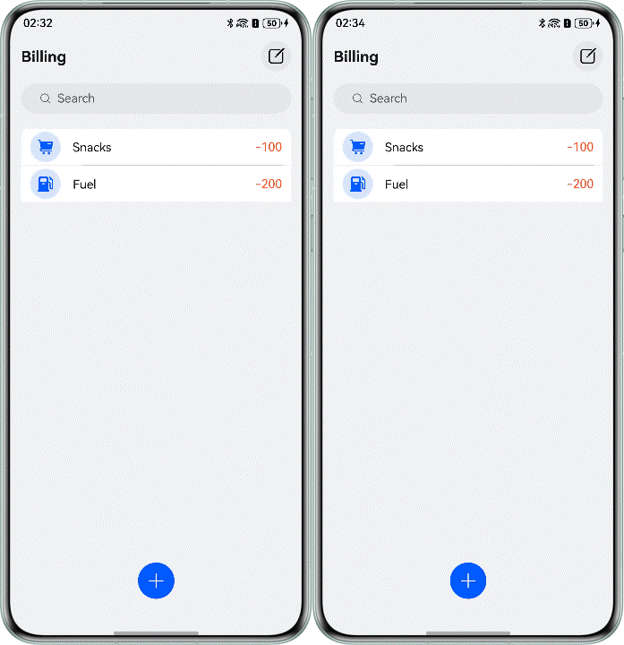
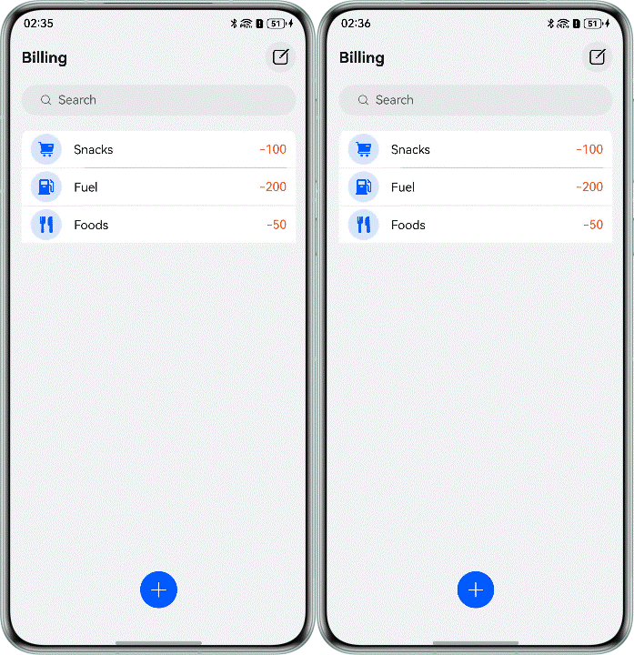
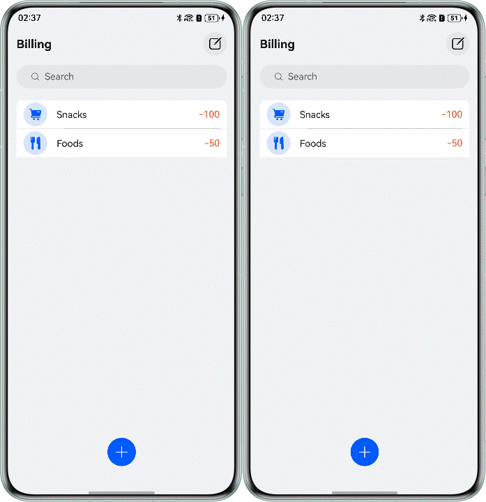
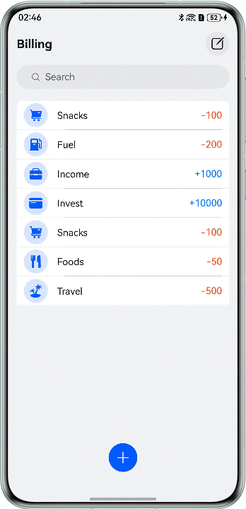

# Realization of billing function based on distributed relational database

## Overview

Taking the distributed bill as an example, this Codelab uses the related interfaces of relational database to realize the operations of adding, deleting, modifying, checking and synchronizing the bill. The effect diagram is as follows:

## Preview

|                              Add                              |                            Delete                             |                              Edit                              |                              Query                              |
|:-------------------------------------------------------------:|:-------------------------------------------------------------:|:--------------------------------------------------------------:|:---------------------------------------------------------------:|
|  |  |  |  |

## How to Use

1. On the application homepage, click the "Add" icon in the lower right corner, select the account type and fill in the amount in the pop-up window, and click "OK" to add an account.
2. On the application homepage, click the "Edit" icon in the upper right corner, select the account to be deleted, and click the "Delete" icon below to delete the selected account.
3. On the application homepage, click the account you want to edit, change the account type or amount in the pop-up window, and click OK to modify an account.
4. On the home page of the application, click the search column and fill in the amount of the account you want to find. Click the "Search" icon and the bottom will be refreshed to the account with the amount of the found amount. When the search column is empty, all accounts will be displayed.

## Project Directory

```
├──entry/src/main/ets
│  ├──common
│  │  └──CommonConstants.ets           // Constant set
│  ├──components
│  │  └──BillDialog.ets                // Bill pop-up assembly
│  ├──entryability
│  │  └──EntryAbility.ets              // Entry file
│  ├──pages
│  │  └──BillHomePage.ets              // First page of bill
│  ├──utils
│  │  └──RdbManager.ets                // Relational database management class
│  └──viewmodel
│     └──BillViewModel.ets             // Bill model
└──entry/src/main/resources            // Resource file
```

## How to Implement

1. When the application starts for the first time, call the requestPermissionsFromUser() method to dynamically pop up the window to get authorization.
2. Create a relational database, create a relational database through relationalStore.getRdbStore(), and set the distributed database tables through the setDistributedTables() method.
3. Call the on('dataChange') interface to subscribe to the data changes of other devices in the networking, and register the data change callback function.
4. Encapsulates four methods of adding(insert()), deleting(delete()), changing(update()) and searching(query()) to the operation database.
5. Call the interface sync() of synchronous data to push the current device data change to other devices in the networking.
6. Get the changed data list and update the local data.

## Permissions

* ohos.permission.DISTRIBUTED_DATASYNC：Allow data exchange between different devices.

## Constraints

1. The sample is only supported on Huawei phones with standard systems.
2. The HarmonyOS version must be HarmonyOS 5.1.1 Release or later.
3. The DevEco Studio version must be DevEco Studio 5.1.1 Release or later.
4. The HarmonyOS SDK version must be HarmonyOS 5.1.1 Release SDK or later.
5. Double-ended devices need to log in to the same Huawei account, so it is recommended to turn on the device finding function.
6. Double-ended devices need to turn on the Wi-Fi and Bluetooth switches. When conditions permit, it is recommended to connect to the same LAN.
7. Both end devices need this application.
